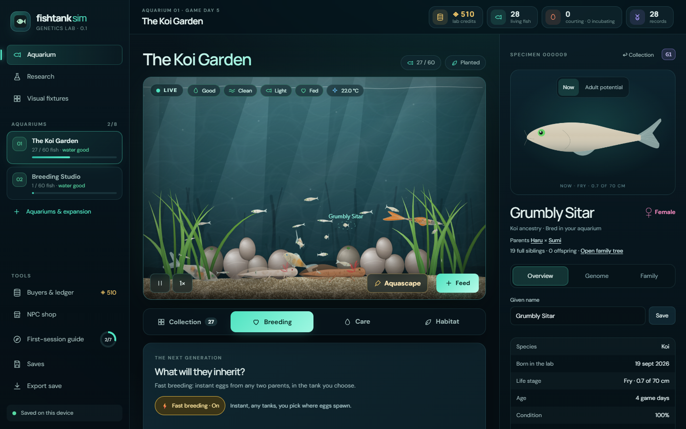
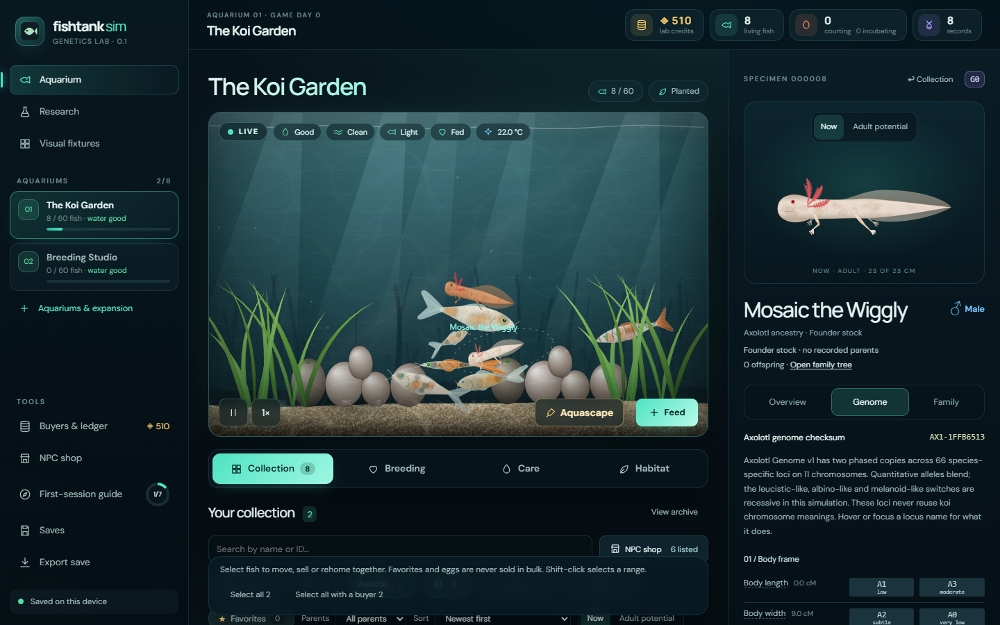
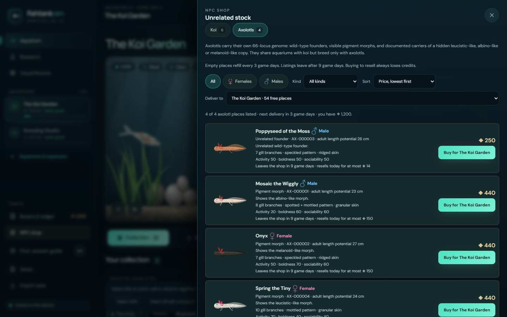

# Fishtank Sim

**A living aquarium and genetics sandbox.** Breed koi and axolotls whose looks and behavior come from inherited (synthetic) genomes. Every animal is drawn from its genes, every child keeps a permanent family record, and a rare trait can be followed across generations.



> **Version 0.1: a working research lab.** The core loop works: genome → development → appearance → breeding → lineage. The full care game and an online marketplace are designed but not built yet. See [implementation status](docs/IMPLEMENTATION_STATUS.md).

## Features

- **Heritable genetics.** Koi genomes carry up to 66 loci on 11 synthetic chromosomes (body shape, color, patterns, fins, structure and behavior), with phased chromosomes, crossover and mutation. Axolotls have their own separate 66-locus genome covering limbs, gills, pigment morphs, patterns and temperament.
- **Two species, one tank.** Koi and axolotls share aquariums, water and care, but each species only breeds with its own kind.
- **Breeding.** Pair two healthy adults that share a tank. Courtship takes a few game days, reserves places in a nursery tank, pauses with a reason if something goes wrong, and ends in a tracked clutch of eggs. An optional fast mode skips courtship for quicker experiments.
- **Offspring prediction.** Exact single-locus odds and sampled adult-trait ranges before you breed, plus breeding goals that rank candidates for up to four traits.
- **Family trees.** Six generations of ancestors and descendants, pedigree inbreeding, mutation origins and named bloodlines.
- **Growth and care.** Eggs hatch into fry that grow toward their genetic adult size. Water quality, feeding, filters, aeration and temperature affect condition and growth.
- **A small economy.** NPC buyers with different tastes, a credit ledger, an NPC shop for unrelated stock, extra aquariums, and a free koi rescue if you run out of options.
- **Safe local saves.** Everything is stored in your browser with two automatic backups, export/import, and replayable command journals.

| | |
|---|---|
|  |  |
| **Collection and genome inspector** | **NPC shop** with axolotl pigment morphs |

## Tech stack

| Area | Used |
|---|---|
| UI | [React 19](https://react.dev) and TypeScript 7 |
| Build and dev server | [Vite 8](https://vite.dev) |
| Rendering | HTML Canvas 2D, with procedural anatomy for every animal |
| Simulation | A Web Worker running fixed-step motion and steering |
| Genetics | A pure TypeScript core with seeded random number streams, so every cross replays exactly |
| Validation | [Zod 4](https://zod.dev) for commands, saves and imports |
| Storage | IndexedDB with backups, plus a Web Locks single-writer lease |
| Tests | [Vitest 5](https://vitest.dev) (about 290 tests); Playwright scripts for browser journeys |

There is no backend, account, API key or environment file.

## Run locally

Requires Node.js 22.12 or newer, and npm.

```sh
npm ci
npm run dev
```

Open the address Vite prints, normally [http://127.0.0.1:5173](http://127.0.0.1:5173).

```sh
npm test        # Genetics, pedigree, commands, save validation and motion
npm run build   # Strict TypeScript check and production bundle
npm run check   # Both
npm run preview # Serve the production build
```

The npm cache is kept inside the checkout (`.npmrc`); it, `node_modules` and build output are ignored by Git.

With the dev server running, `/bench.html` is the renderer benchmark used by
[FS-701](docs/research/FS-701-RENDERER-SPIKE.md): it times Canvas 2D against PixiJS on the same seeded scene and reports
frame cost, cache size and how much each detail tier actually changes on screen. It is a measuring page — the production
build does not include it, or PixiJS.

## Quick tour

1. **Meet your fish.** Click a swimming animal or a collection card to open it in the inspector: overview, genome and family.
2. **Breed.** Open **Breeding**, pick a mother and father, choose a nursery and start a courtship.
3. **Watch them grow.** Eggs hatch after 3 game days (one game day passes per real minute) and grow faster in well-kept water.
4. **Follow the lineage.** Open **Family** on any child to walk up to six generations back or forward.
5. **Manage the lab.** Sell to NPC buyers or rehome for free, buy new stock in the **NPC shop**, add aquariums and decorate them under **Habitat**.
6. **Keep your world.** **Saves** exports, imports and restores backups.

A first-session guide above the aquarium walks through these steps. Limits: 60 animals per tank, 8 tanks, 480 living animals and 10,000 records including the archive.

## Project documents

| Read | Purpose |
|---|---|
| [Game design document](docs/GDD.md) | Product vision, gameplay, care, economy and progression |
| [Genetics specification](docs/GENETICS.md) | Genome rules, loci, color and ornament expression, pedigree |
| [Architecture](docs/ARCHITECTURE.md) | Source map, data model, command contracts, worker strategy |
| [UX specification](docs/UX_SPEC.md) | Aquarium, inspector, breeding, family, market and recovery flows |
| [Balance and experiments](docs/BALANCE.md) | Implemented constants and tuning experiments |
| [Roadmap](docs/ROADMAP.md) and [backlog](docs/BACKLOG.md) | Milestones, task IDs and acceptance criteria |
| [Implementation status](docs/IMPLEMENTATION_STATUS.md) | What actually works today, and known limits |
| [Testing and verification](docs/TESTING.md) | Automated and browser evidence |
| [Decision log](docs/DECISIONS.md) | Decisions and when to revisit them |
| [Agent handoff](docs/HANDOFF.md) | Read order, commands and conventions |
| [Original concept](docs/source/original-concept.txt) | The preserved source notes |

New contributors and agents should start with [AGENTS.md](AGENTS.md), then [implementation status](docs/IMPLEMENTATION_STATUS.md).

## Status and license

Developed on `main` in [ElMariones/fishtank-sim](https://github.com/ElMariones/fishtank-sim). There is no public deployment. No license has been chosen yet, so public visibility does not grant reuse rights.
