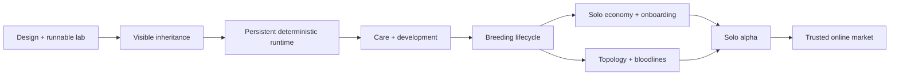

# Milestone schedule and delivery strategy

**Planning basis:** one experienced full-time developer, roughly 30 focused implementation hours/week (five six-hour workdays), with periodic user feedback and some procedural-art support. These are estimates, not commitments. AI assistance can reduce authoring time but does not remove playtesting, rendering iteration, browser compatibility work, or integration risk.

**Suggested start:** Monday 14 September 2026. Relative weeks are authoritative; calendar dates below are nominal and do not account for holidays or availability. No reminders, scheduled jobs, or background agents have been created.

## 1. Release sequence

| Milestone | Nominal weeks / dates | Base effort | Result | Gate to move on |
|---|---|---:|---|---|
| M0 — Design and lab skeleton | Delivered 13 Sep 2026 | Existing foundation | GDD, contracts, lab, automated core checks | Runnable and accurately documented |
| M1 — Heritable visual proof | W1–2 · 14–27 Sep | 10 days | Better anatomy/pattern inheritance, comparison experiment | Selection shifts traits; human testers recognize family resemblance |
| M2 — Persistence and simulation runtime | W3–5 · 28 Sep–18 Oct | 15 days | Worker protocol, fixed time, IndexedDB, recovery | Reload/replay and active/background parity fixtures |
| M3 — Living aquarium | W6–9 · 19 Oct–15 Nov | 20 days | Care, life stages, utility behavior, habitat footprints | Fish react legibly; habitat affects development |
| M4 — Breeding lifecycle and genealogy | W10–12 · 16 Nov–6 Dec | 15 days | Courtship, clutches, nursery limits, deep family view | Complete two generations without instant-lab shortcuts |
| M5 — Solo management game | W13–15 · 7–27 Dec | 15 days | NPC demand, tanks/equipment, decoration tools, onboarding | Complete first-session loop and avoid economic softlock |
| M6 — Advanced anatomy and lineages | W16–18 · 28 Dec–17 Jan 2027 | 15 days | Supported structural mutations, genome v3, named lines | Koi-to-unusual-line demonstration with valid ancestry |
| M7 — Solo alpha hardening | W19–22 · 18 Jan–14 Feb | 20 days | Performance, migration, recovery, accessibility, playtests | Alpha acceptance matrix passes on named hardware |
| Contingency | Up to 6 additional weeks | 30 days | Resolve visual and simulation uncertainty | Retain core promises; cut optional systems first |
| M8 — Trusted online economy | After solo gate; 8–12 further weeks | 40–60 days | Auth, server-owned world, listings, atomic trades | Concurrency/security/economy tests and private pilot |

Core solo baseline: **110 focused developer-days / 22 weeks**, with approximately 27% contingency giving an upper planning envelope of 28 weeks. Calendar slots assume uninterrupted work and are not a promised February/March launch. M8 is additional; do not silently overlap it with unresolved solo scope.

The detailed backlog estimates sum to each milestone’s base effort. A day includes implementation and its listed validation, not only code typing.

## 2. First ten working days

| Day | Focus | Reviewable result |
|---|---|---|
| 1 | Read handoff; freeze v1 fixtures and phenotype descriptor ranges | Baseline seed/appearance contact sheet and measured trait file |
| 2–3 | Improve body/head/fin anchors and readable silhouette extremes | Normal koi and six extreme fixtures, no detached anatomy |
| 4–5 | Preserve low-frequency inherited pattern structure | Parents + 20 children comparison board for several crosses |
| 6 | Add cohort sorting and retained breeding candidates | Player can select a goal and choose next-generation parents |
| 7–8 | Run automated selection experiments and small observer study | Ten-generation curves plus resemblance observations |
| 9 | Keyboard/text-size/touch review of lab actions | Core lab loop usable without hitting moving fish |
| 10 | Resolve findings, document gate decision and next scope | M1 review with pass/fail evidence and prioritized remaining risks |

If family resemblance fails, do not begin a full shop implementation. Spend the next iteration on pattern inheritance and silhouette descriptors.

## 3. Critical path

Work can be divided among future agents when requested, but ownership boundaries must be explicit. A renderer task can run beside persistence work after the phenotype contract is frozen. Two agents should not simultaneously reorder genes, edit model versions, or implement competing command reducers.

## 4. Review cadence

- End of each milestone: live demonstration, test evidence, updated status, scope decision.
- Weekly: one short recorded assessment of biggest risk, spent/remaining estimate, and next playable behavior.
- For genetics changes: compare old/new cohorts using fixed seeds; report intended phenotype drift.
- For simulation changes: compare active and background integration; evaluate absence and event-boundary behavior.
- For persistence changes: migration fixtures and recovery demo are release gates.
- For economy changes: run source/sink experiments and no-funds recovery; no arbitrary price tweaks without a stated target.

## 5. Scope reduction order

If schedule pressure grows, cut auctions, competition prestige, hidden sequencing, fancy water effects, rare topology variety beyond one template, and automated breeding suggestions. Preserve visible inheritance, live behavior, clickable identity/pedigree, reliable saves, bounded nursery management, and at least one meaningful care loop.

Do not claim an empty marketplace route or inert button as a shipped feature. The solo alpha can have a well-defined NPC market while the online market remains planned.

## 6. Definition of done for any task

The behavior works through its user flow; domain invariants are validated at mutation boundaries; save impact and version changes are documented; appropriate tests/build pass; keyboard and error states are considered; implementation status names what is real; and the next agent has a concrete continuation point.

Each task should finish as a small reviewable change. Remote publication, production provisioning, or shared-economy activation is not implied by completing a local code task.
