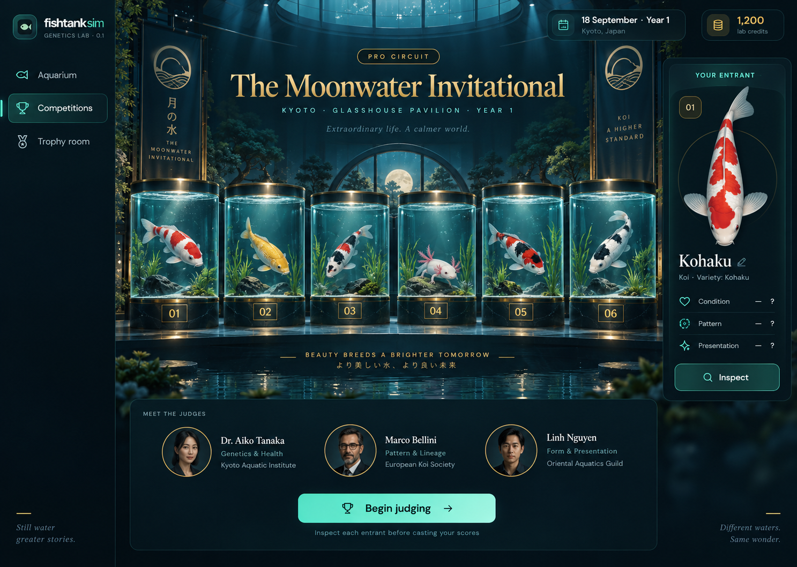

# Competition UI design translation

21 September 2026 · Reference for FS-125–127

The reference was generated before implementation, using the existing aquarium screenshot as product context. It establishes a theatrical aquatic exhibition within the current lagoon shell. The concept is art direction, not a substitute for functional controls or the genome renderer.

## Visual hierarchy

Keep the narrow dark navigation rail and compact calendar/credit header. The event title is the strongest element: large warm-gold Georgia/serif lettering, a small tier label, and widely spaced city/venue metadata. Pair it with the existing readable interface sans serif. Themes vary accent colors and event atmosphere deterministically, so reopening a show preserves its identity.

Use the generated [pavilion background](../../public/art/competition-pavilion.png) behind the exhibition. Darken it enough for text and specimen contrast. Preserve negative space around the title. Foreground animal displays are real Canvas portraits on translucent aquarium surfaces; their colors and shapes must come from the saved phenotype. Do not replace them with the painted animals in the concept.

On desktop, show the exhibit gallery beside an inspection/negotiation panel. Place the judges and the Begin judging action beneath the gallery. On narrower screens, wrap exhibits and move inspection below them. The entry board and trophy room reuse the shell, typography, buttons and spacing, without imitating the ceremony's dramatic density everywhere.

## Motion and result states

An active judging pass highlights an exhibit/criterion with a gentle light sweep. Three named judges progress through presentation, pattern and condition. The result podium promotes first place in the center, with second and third beside it; the full table remains easy to read below. Gold, silver and bronze are paired with explicit rank text. Short entrance and glow effects celebrate the reveal without hiding controls.

Reduced motion suppresses nonessential movement. Skip ceremony produces the same saved results. Leaving the screen or reloading never charges again. Focusable native buttons, visible focus styles, labeled inputs, status text and sufficient text/background contrast take precedence over decorative flourishes.

## Deliberate translation choices

The generated image includes a mixed-species display as visual exploration; actual events separate koi and axolotls for coherent judging. Its illustrated judges become named functional criterion panels rather than invented photographic characters. Existing genome-based side-profile animals remain the visual source of truth. Use the pavilion art for atmosphere and real interface elements for all text, filters, scores and actions.

Browser verification must inspect the board, selection, exhibition, judging, result table, negotiation and trophy room; a screenshot alone cannot demonstrate those behaviors.
